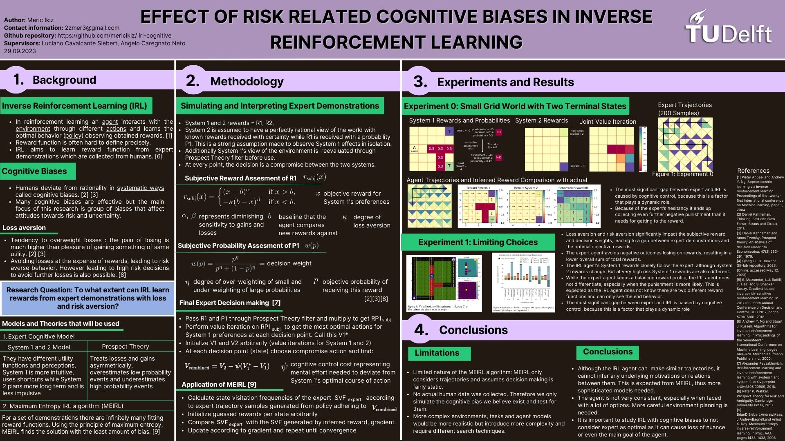
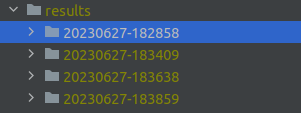
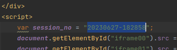
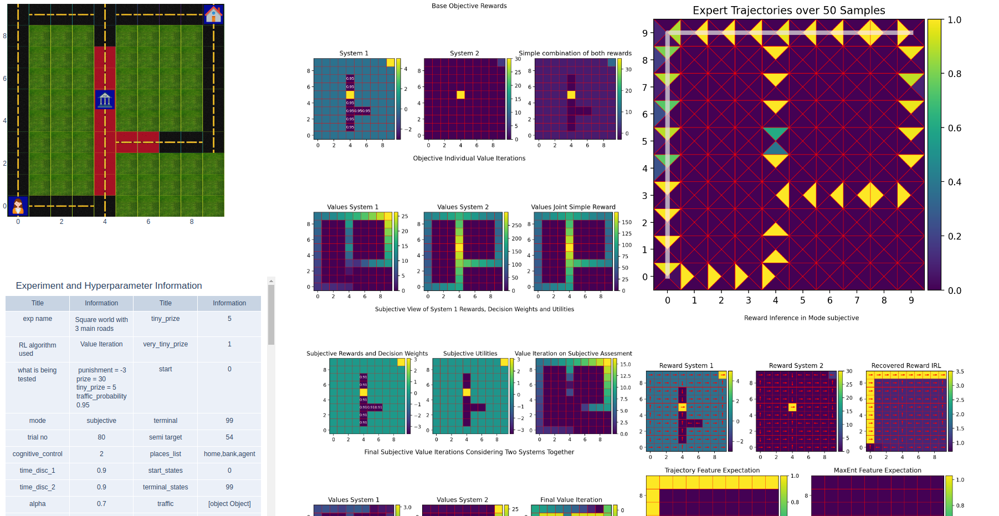

# Inverse Reinforcement Learning (IRL) in Presence of Risk and Uncertainty Related Cognitive Biases: 
## To what extent can IRL learn rewards from expert demonstrations with loss and risk aversion?

This repository is the code base used for my Bachelor end project for TU Delft 2023. Report can be found at https://repository.tudelft.nl/islandora/object/uuid:1571ca1f-3f46-4cf1-982e-b012316644f8?collection=education. Below is the poster summarizing the information:

### Executing Experiments
Go to saved_exp folder and choose which experiment you want to execute from multiple_experiments.py. You can overwrite the default values for hyperparameters and environment characteristics by creating new dictionaries using the methods in default_values.py. 
To create new experiments you can define places, roads and rewards similarly by changing the dictionaries.
After an experiment trial is executed they are saved under a folder created in the name "results".

Copy the name of the folder corresponding to the experiment and paste it into the singleExperimentTemplate.html as shown below.

Now open singleExperimentTemplate.html and you should see all the related information to the experiment.

You can analyse the results using the folder evaluation_utils.

In case of any questions, don't hesitate to contact me using information in the poster!

